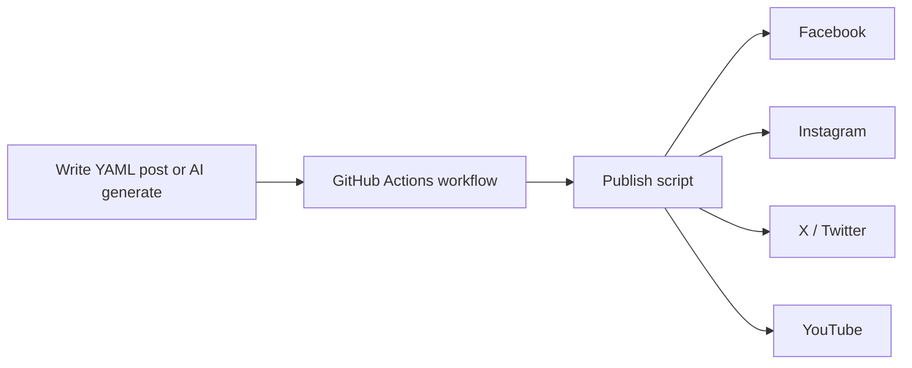

# Social Media Automation

Cross-post content to **Facebook**, **Instagram**, **X (Twitter)**, and **YouTube** from one place using GitHub Actions.

Built for [Bishnupriya Fuels](https://github.com/) (BPCL outlet, Jajpur) but works for any business.

## How it works



1. You add a post file under `content/posts/` (or run the AI workflow).
2. GitHub Actions runs on a schedule (daily 9 AM IST) or manually.
3. The script posts the same caption/media to every configured platform.
4. Published posts are archived as `*.published.yaml`.

## Quick start

### 1. Create a new GitHub repository

```bash
cd social-media-automation
git init
git add .
git commit -m "Initial commit: social media automation"
gh repo create bishnupriya-social --public --source=. --push
```

Or push this folder to its own repo on GitHub.

### 2. Add account credentials as GitHub Secrets

Go to **Repository → Settings → Secrets and variables → Actions → New repository secret**.

| Secret | Platform | Required for |
|--------|----------|--------------|
| `META_PAGE_ACCESS_TOKEN` | Facebook + Instagram | Page posts, IG media |
| `META_PAGE_ID` | Facebook | Page ID |
| `INSTAGRAM_BUSINESS_ACCOUNT_ID` | Instagram | Business/Creator account |
| `TWITTER_API_KEY` | X | App key |
| `TWITTER_API_SECRET` | X | App secret |
| `TWITTER_ACCESS_TOKEN` | X | User token |
| `TWITTER_ACCESS_TOKEN_SECRET` | X | User token secret |
| `YOUTUBE_CLIENT_ID` | YouTube | OAuth client |
| `YOUTUBE_CLIENT_SECRET` | YouTube | OAuth client |
| `YOUTUBE_REFRESH_TOKEN` | YouTube | Long-lived upload token |
| `GEMINI_API_KEY` | AI generation (Gemini) | Optional |

Never commit tokens to the repo. Use GitHub Secrets only.

### 3. Create your first post

Copy `content/posts/example.yaml`:

```yaml
id: monday-tip-001
status: pending
publish_at: ""   # empty = publish on next workflow run
platforms:
  - facebook
  - instagram
  - twitter
  - youtube

title: Tyre care before monsoon drives
caption: |
  Before the rains, check tyre tread and pressure at Bishnupriya Fuels.
  We are on your route at Padmalavpur, Manduka, Jajpur.

  WhatsApp fleet inquiries: +91 96689 13299

hashtags:
  - BishnupriyaFuels
  - BPCL
  - Jajpur

media:
  image: media/forecourt.jpg   # required for Instagram
  video: media/tour.mp4        # required for YouTube
```

Add your photo/video under `media/`, commit, and push.

### 4. Run the workflow

**Actions → Publish Social Posts → Run workflow**

Use **dry run** first to validate without posting.

---

## Platform setup guides

### Facebook + Instagram (Meta)

1. Create a [Meta Developer](https://developers.facebook.com/) app.
2. Add products: **Facebook Login**, **Instagram Graph API**.
3. Connect your **Facebook Business Page** to the app.
4. Convert Instagram to a **Business** or **Creator** account linked to that Page.
5. Generate a **Page Access Token** with permissions:
   - `pages_manage_posts`
   - `pages_read_engagement`
   - `instagram_basic`
   - `instagram_content_publish`
6. Find IDs:
   - Page ID: Page → About → Page transparency, or Graph API Explorer `me/accounts`
   - Instagram Business Account ID: `/{page-id}?fields=instagram_business_account`

### X (Twitter)

1. Apply at [developer.x.com](https://developer.x.com/).
2. Create a project + app with **Read and Write** permissions.
3. Generate **Access Token and Secret** for your account.
4. Add all four keys to GitHub Secrets.

Free tier limits apply; check current X API pricing.

### YouTube

1. Create a project in [Google Cloud Console](https://console.cloud.google.com/).
2. Enable **YouTube Data API v3**.
3. Create **OAuth 2.0 Desktop** credentials.
4. Run the one-time OAuth flow locally to get a refresh token:

```bash
cp .env.example .env
# fill YOUTUBE_CLIENT_ID and YOUTUBE_CLIENT_SECRET

npm install
node scripts/setup-youtube-oauth.js
```

5. Copy the printed refresh token to GitHub Secret `YOUTUBE_REFRESH_TOKEN`.

YouTube posts require `media.video` in the YAML file.

---

## Workflows

| Workflow | Trigger | Purpose |
|----------|---------|---------|
| **Publish Social Posts** | Daily 9 AM IST + manual | Publishes all `status: pending` posts |
| **Generate and Publish** | Manual | AI writes caption from a topic, optional publish |

### Manual publish options

- **post_id**: publish one specific post
- **dry_run**: test without posting

### AI generate options

- **topic**: what to write about
- **image_path** / **video_path**: attach repo media
- **platforms**: comma-separated list
- **publish_now**: post immediately after generation

---

## Local development

```bash
npm install
cp .env.example .env
# fill credentials in .env

npm run verify          # check which platforms are configured
npm run publish:dry-run # test pending posts
npm run publish         # publish for real
npm run generate -- "fleet diesel services in Jajpur"
```

---

## Content rules

| Platform | Text | Image | Video |
|----------|------|-------|-------|
| Facebook | Yes | Optional | Optional |
| Instagram | Caption | **Required** (or video) | Reels supported |
| X | Yes (280 chars, auto-truncated) | Optional | Optional |
| YouTube | Description | Thumbnail auto | **Required** |

The same caption is reused everywhere. YouTube also uses the `title` field.

---

## Scheduling posts

Set `publish_at` in ISO format with timezone:

```yaml
publish_at: "2026-06-15T09:00:00+05:30"
status: pending
```

The daily workflow publishes posts whose time has passed.

---

## Security notes

- Credentials live in GitHub Secrets, not in code.
- Use a dedicated Meta/X/Google app for this repo.
- Rotate tokens if leaked.
- Review AI-generated text before enabling auto-publish in production.

---

## Troubleshooting

| Error | Fix |
|-------|-----|
| Instagram requires image | Add `media.image` or `media.video` |
| YouTube requires video | Add `media.video` and enable `youtube` platform |
| Meta token expired | Regenerate Page Access Token; long-lived tokens last ~60 days |
| X 403 Forbidden | Check app has Write permission and tokens match the app |
| Workflow cannot push | Enable **Read and write** permissions for Actions in repo settings |

---

## License

MIT
